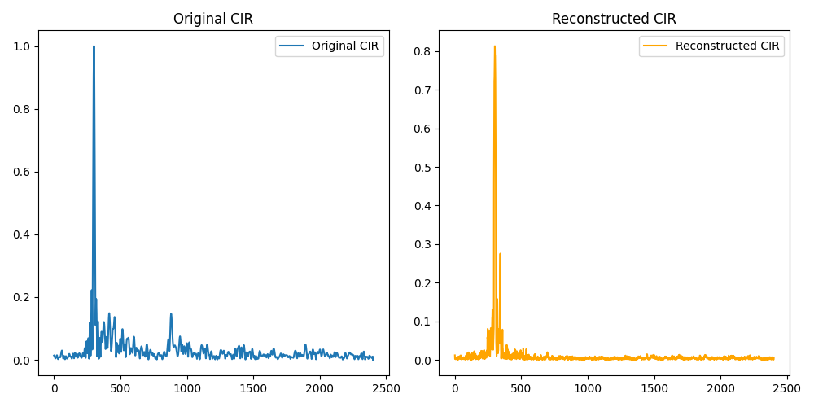
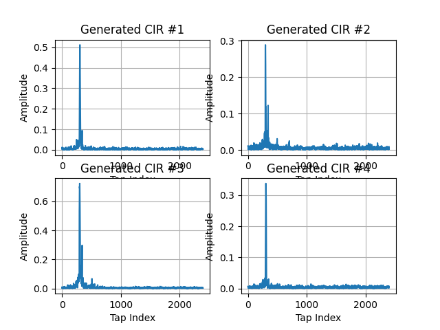

# VAE for Channel Impulse Response in Underwater Acoustics

Channel Impulse Response (CIR) modeling is crucial in underwater acoustics for understanding how signals propagate through the medium. This repository provides an implementation of a Variational Autoencoder (VAE) designed to model CIRs, trained on real field-recorded CIR data from a full-duplex underwater communication experiment. The trained VAE is able to sample from the learned distribution and generate new impulse responses, which can be useful for various applications in underwater communication systems.

<strong> TL;DR: </strong> This repo implements a VAE that learns to reconstruct and generate real underwater CIRs from field data, inspired by Dr. Wang’s WUWNet 2021 paper.

## Paper

This repository is an implementation of Dr. Wang's 2021 paper ([link](https://doi.org/10.1145/3491315.3491330)) which explores the use of VAEs for modeling channel impulse responses in underwater acoustics.

## Dataset
This project uses real underwater acoustic channel data collected during a field experiment in Lake Tuscaloosa (July 2019) ([link](https://ieee-dataport.org/open-access/band-full-duplex-underwater-acoustic-communication-measurements-self-interference)). The setup involved a single transmission-receiving line with one acoustic transmitter and eight hydrophones, moored at the center of the lake. The experiment transmitted both BPSK and OFDM waveforms at a center frequency of 28 kHz. The dataset includes:

- Raw .wav recordings from digital hydrophones
- Preprocessed channel impulse responses (CIRs)
- MATLAB tools for data extraction and analysis

This dataset provides a realistic basis for modeling and learning underwater acoustic channel behavior.

## Results
CIRs sampled from VAE latent space 

## What's Next
- Extending to conditional VAE (cVAE) environmental metadata from various sources (e.g., temperature, salinity, etc.)
- Adding metrics like delay spread or correlation with real CIRs
- Preparing a short project PDF and writeup for submission

### Reach out
You can reach me at my <a href="mailto:shaiq.e.mustafa@gmail.com">email</a>